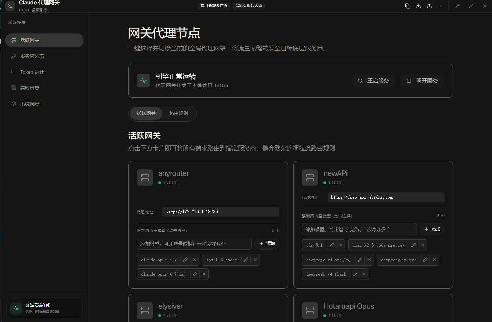
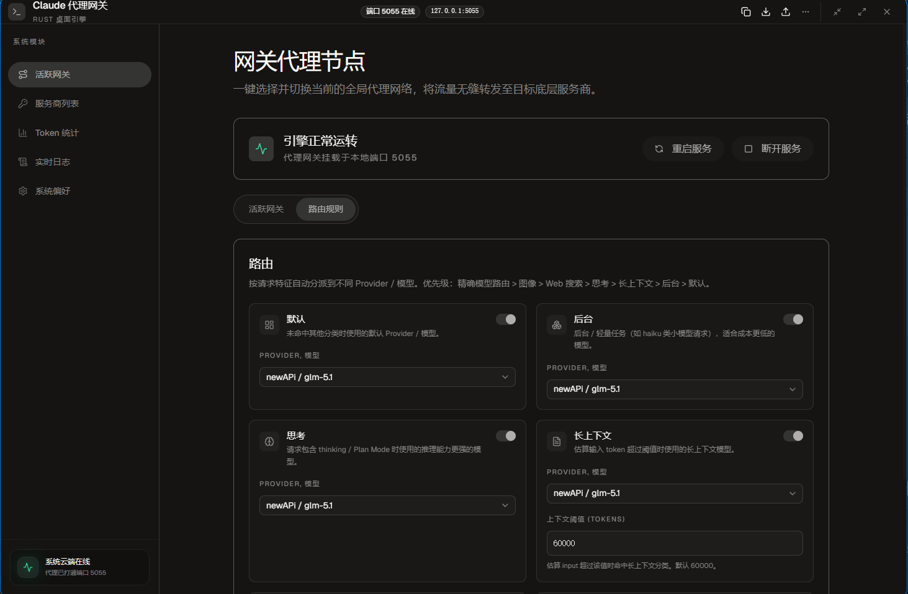

# Claude 代理网关

一个本地 Claude API 代理桌面工具，基于 `Tauri 2 + Rust + React`。它把多个上游 Provider、模型和路由规则集中到一个本地网关里，让 Claude CLI、SDK 或其他兼容客户端统一走 `http://127.0.0.1:5055`。





## 界面概览

### 活跃网关

活跃网关用于快速选择当前全局代理节点。启用后，请求会转发到选中的 Provider，适合在不同底层服务商之间一键切换。

- 显示本地代理端口与运行状态
- 管理 Provider 代理地址、启用状态和可用模型
- 支持为 Provider 指定可承接的模型列表
- 支持重启服务、断开服务等常用操作

### 路由规则

路由规则用于按请求特征自动分派到不同 Provider / 模型，减少手动切换成本。

- 默认：未命中其他分类时使用
- 后台：适合 `haiku` 类轻量模型请求
- 思考：适合包含 `thinking` / Plan Mode 的高推理请求
- 长上下文：输入 token 超过阈值后切换长上下文模型
- 图像、Web 搜索等分类在代理层按优先级识别

## 功能特性

- 本地 HTTP 代理服务，拦截并转发 Claude API 请求
- 支持活跃网关模式，一键切换全局 Provider
- 支持路由规则模式，按请求类型自动选择模型
- 支持多 Provider 管理和自定义 Provider 配置
- 支持模型级 Base URL、API Key、目标模型配置
- 支持 OpenAI Chat Completions 到 Anthropic Messages 的兼容转换
- 支持自定义 API 端点和密钥配置
- 支持系统托盘、开机自启动和隐藏到托盘
- 支持实时请求日志查看和 Token 使用统计
- 支持通过 `DATA_DIR` 持久化配置，重建环境后可恢复

## 快速开始

### 安装依赖

```bash
npm install
```

### 桌面开发模式

```bash
npm run dev
```

该命令会启动：

- Vite 前端开发服务器
- Tauri 桌面壳
- Rust 本地代理运行时

### Legacy Web 调试

如需回看迁移前的 Node/Web 链路，可使用：

```bash
npm run dev:legacy
```

### 浏览器工具隔离用法

仓库内已经预留三套互不共享的浏览器入口，避免 `Playwright`、`chrome-devtools-mcp`、`agent-browser` 抢同一个实例：

```bash
# 检查本机浏览器工具状态
npm run browser:doctor

# agent-browser: 独立 profile
npm run browser:agent:app

# Playwright: 独立 profile
npm run browser:playwright:app

# chrome-devtools-mcp: 先拉起独立 Chrome，再让 MCP 连接到 9223
npm run browser:chrome-mcp:app
npm run browser:chrome-mcp:server
```

详细约定见 `docs/browser-tooling.md`。

### 构建打包

```bash
# 构建 Tauri 桌面安装包
npm run build

# 仅构建前端资源
npm run build:web
```

## 使用说明

### 1. 启动代理服务

打开应用后，点击"启动服务"按钮，代理服务将在本地 5055 端口启动。

### 2. 配置客户端

#### Claude CLI

在应用中点击"一键配置代理"按钮，或手动设置环境变量：

```bash
# Windows PowerShell
$env:ANTHROPIC_BASE_URL="http://127.0.0.1:5055"

# Linux/Mac
export ANTHROPIC_BASE_URL="http://127.0.0.1:5055"
```

#### Python SDK

```python
import os
os.environ["ANTHROPIC_BASE_URL"] = "http://127.0.0.1:5055"
```

### 3. 配置模型路由

在"模型路由配置"区域为不同的源模型分别配置目标上游：

- 源模型：客户端请求中的 `model`
- 目标 Provider：命中后使用的上游服务
- 目标模型：转发到上游时实际写入的模型名
- Base URL：该模型路由专用网关地址
- API Key：该模型路由专用密钥

代理会优先按源模型精确命中这些路由；未命中时才使用默认回退映射。

### 4. 配置 Provider（共享 / 兼容层）

在"Provider 配置（共享 / 兼容）"区域维护共享 Provider 信息和 legacy fallback 可选目标：

- 名称：自定义名称
- Base URL：API 端点地址
- API Key：你的密钥
- 模型列表：支持的模型 ID

### 5. 默认回退映射

在"模型路由 / 默认回退"区域选择未命中任何模型路由时的默认目标。该设置会同步写入 legacy `main/haiku` 映射。

## Docker 持久化

服务默认把运行时配置写到 `DATA_DIR/config.json`。在 `docker-compose.yml` 中，`DATA_DIR` 被设置为 `/app/data`，并通过卷挂载到宿主机的 `./data`：

```yaml
environment:
  DATA_DIR: "/app/data"
volumes:
  - ./data:/app/data
```

只要这个宿主机目录或命名卷还在，即使 Docker 容器被删除并重新创建，模型路由、Provider 和默认回退配置也会自动恢复。

## 技术栈

- Tauri 2
- Rust
- React 18
- TypeScript
- Vite 7
- Axum + Reqwest

## 项目结构

```
claude-proxy/
├── src-tauri/        # Tauri 2 + Rust 桌面运行时、配置持久化、代理转发
├── src/              # React 前端源码
│   ├── components/   # UI 组件
│   ├── hooks/        # 自定义 Hooks
│   ├── services/     # Desktop / Web 桥接层
│   └── styles/       # 样式文件
├── server/           # legacy Node/Web 代理实现，仅用于迁移对照
├── data/             # legacy 默认配置目录
├── public/           # 静态资源
└── package.json      # 项目配置
```

## 开发说明

### 构建前端

```bash
npx vite build
```

## 许可证

MIT License
