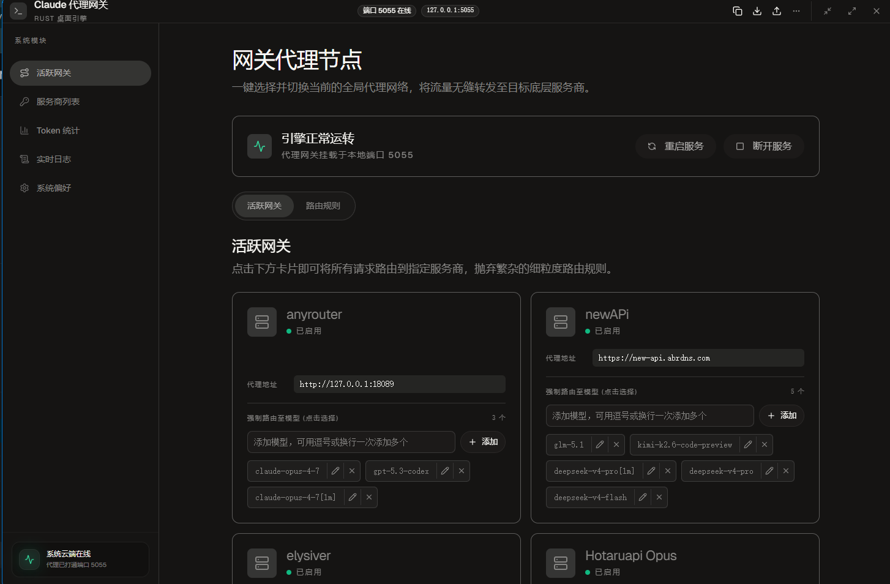
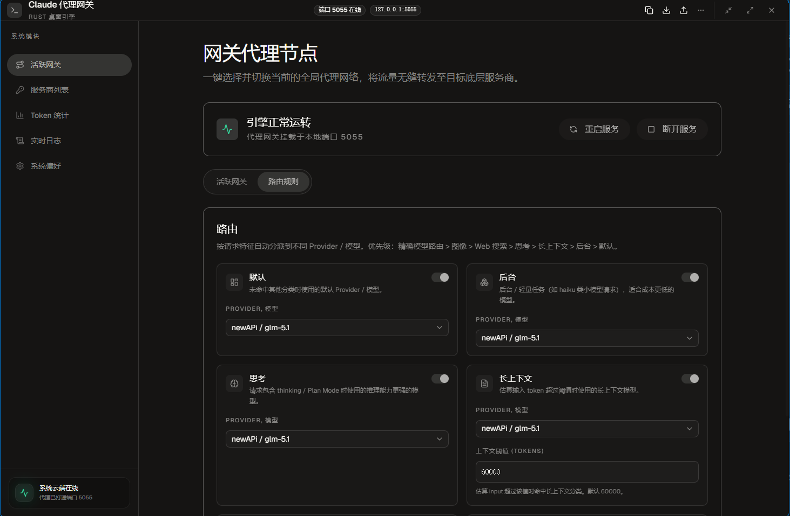

# Claude Proxy

当前版本：`1.0.1`

一个本地 Claude API 代理桌面工具，基于 `Tauri 2 + Rust + React`。它把多个上游 Provider、模型和路由规则集中到一个本地网关里，让 Claude CLI、SDK 或其他兼容客户端统一走 `http://127.0.0.1:5055`。





## 功能特性

- 本地 HTTP 代理服务，拦截并转发 Claude API 请求
- 支持活跃网关模式，一键切换全局 Provider
- 支持路由规则模式，按请求类型自动选择 Provider / 模型
- 支持 `default`、`background`、`think`、`longContext`、`webSearch`、`image` 分类路由
- 支持多 Provider 管理、自定义 Provider、模型列表和自定义请求头
- 支持模型级 Base URL、API Key、目标模型配置
- 支持 OpenAI Chat Completions 到 Anthropic Messages 的兼容转换
- 支持系统托盘、开机自启动、隐藏到托盘和浮动小窗
- 支持实时请求日志、重复日志折叠和 Token 使用统计
- 支持配置导入导出和 `DATA_DIR` 自定义持久化目录

## 界面概览

### 活跃网关

活跃网关用于快速选择当前全局代理节点。启用后，请求会转发到选中的 Provider，适合在不同底层服务商之间一键切换。

- 显示本地代理端口与运行状态
- 管理 Provider 代理地址、启用状态和可用模型
- 支持为 Provider 指定可承接的模型列表
- 支持启动、停止、重启服务等常用操作

### 路由规则

路由规则用于按请求特征自动分派到不同 Provider / 模型，减少手动切换成本。

- 默认：未命中其他分类时使用
- 后台：适合 `haiku` 类轻量模型请求
- 思考：适合包含 `thinking` / Plan Mode 的高推理请求
- 长上下文：输入 token 超过阈值后切换长上下文模型
- 图像、Web 搜索等分类在代理层按优先级识别

## 快速开始

### 安装依赖

```bash
npm install
```

### 桌面开发模式

```bash
npm run dev
```

该命令会启动：

- Vite 前端开发服务器
- Tauri 桌面壳
- Rust 本地代理运行时

### Renderer-only 开发模式

```bash
npm run dev:web
```

### 构建前端资源

```bash
npm run build:web
```

### 检查 Rust 后端

```bash
npm run check:rust
```

## Windows 打包

在 Windows 环境中执行：

```powershell
npm install
npm run build
```

Tauri 会先执行 `npm run build:web:desktop` 构建前端，再生成桌面安装包。

常见产物路径：

```text
src-tauri/target/release/bundle/nsis/*.exe
src-tauri/target/release/bundle/msi/*.msi
```

如果在 WSL 中操作仓库，建议从 Windows PowerShell 进入项目目录后执行 `npm run build`，避免交叉编译和 WebView2 打包环境问题。

## 使用说明

### 1. 启动代理服务

打开应用后，点击“启动服务”按钮，代理服务会在本地 `5055` 端口启动。

### 2. 配置客户端

#### Claude CLI

在应用中点击“一键配置代理”按钮，或手动设置环境变量：

```powershell
$env:ANTHROPIC_BASE_URL="http://127.0.0.1:5055"
```

```bash
export ANTHROPIC_BASE_URL="http://127.0.0.1:5055"
```

#### Python SDK

```python
import os

os.environ["ANTHROPIC_BASE_URL"] = "http://127.0.0.1:5055"
```

### 3. 配置活跃网关

在“活跃网关”中选择一个启用的 Provider。网关模式会使用 `*` catch-all 路由，把所有请求转发到当前活跃 Provider。

### 4. 配置路由规则

在“路由规则”中为不同请求类别选择 Provider / 模型：

- `default`
- `background`
- `think`
- `longContext`
- `webSearch`
- `image`

路由模式下，代理会按请求特征选择类别，再转发到对应 Provider。

### 5. 配置 Provider

在 Provider 配置中维护上游服务：

- Provider 名称
- Base URL
- API Key
- 支持模型列表
- 自定义请求头
- 需要移除的请求字段

## 配置持久化

桌面运行时默认把配置写入 Tauri 应用数据目录：

```text
config.json
token-usage.json
```

也可以通过 `DATA_DIR` 指定持久化目录：

```bash
DATA_DIR=/path/to/data npm run dev
```

## 浏览器工具隔离用法

仓库内预留了互不共享 profile 的浏览器入口，避免 `Playwright`、`chrome-devtools-mcp`、`agent-browser` 抢同一个实例：

```bash
npm run browser:doctor
npm run browser:agent:app
npm run browser:playwright:app
npm run browser:chrome-mcp:app
npm run browser:chrome-mcp:server
```

注意：当前浏览器脚本默认打开 `http://127.0.0.1:5173`，桌面 Vite 配置使用严格端口 `5180`。调试桌面应用时请传入实际 URL，或按需要更新脚本。

## 技术栈

- Tauri 2
- Rust
- React 18
- TypeScript
- Vite 7
- Axum + Reqwest

## 项目结构

```text
claude-proxy/
├── src-tauri/        # Tauri 2 + Rust 桌面运行时、配置持久化、代理转发
├── src/              # React 前端源码
│   ├── components/   # UI 组件
│   ├── hooks/        # 自定义 Hooks
│   ├── services/     # Desktop / Web 桥接层
│   ├── styles/       # 样式文件
│   └── types/        # 前端配置类型
├── docs/             # 截图和辅助文档
├── public/           # 静态资源
├── scripts/          # 浏览器工具脚本
├── package.json      # 前端脚本和依赖
└── vite.config.ts    # Vite 配置
```

## 常用命令

```bash
npm run dev          # Tauri 桌面开发模式
npm run dev:web      # Renderer-only 开发模式
npm run build        # Tauri 桌面打包
npm run build:web    # 仅构建前端
npm run check:rust   # Rust 后端检查
```

## 许可证

MIT License
